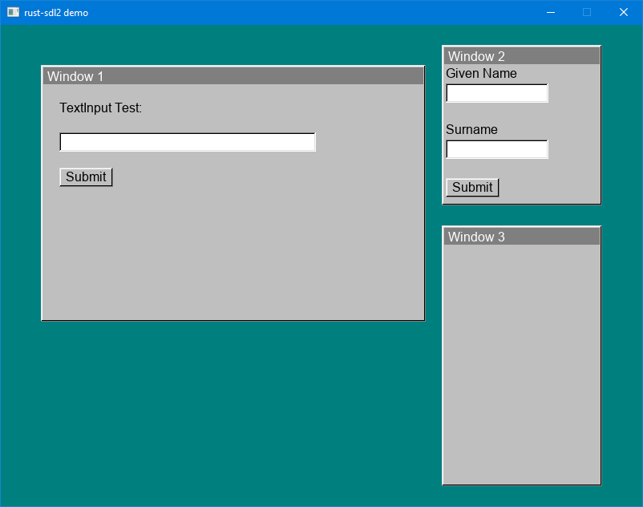
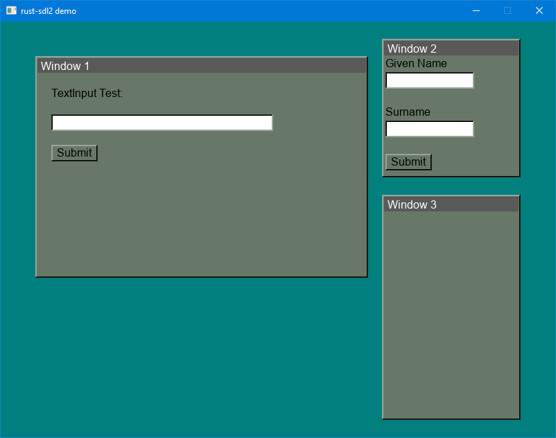

# rust-gui

Inspired by nostalgia for the theming capabilities of Windows 98, this project roughly implements some themable GUI components with SDL graphics.

It's also the project I'm using to learn rust-lang.

## Screenshots

### Classic Theme

### Mystery Theme

## Build and Run

This project was built with rustc 1.54.0. It uses libSDL development libraries version 2.0.16 for Visual C++ available at [https://www.libsdl.org/release/SDL2-devel-2.0.16-VC.zip](https://www.libsdl.org/release/SDL2-devel-2.0.16-VC.zip) as well as the libSDL TTF development libraries version for Visual C++ available at [https://www.libsdl.org/projects/SDL_ttf/release/SDL2_ttf-devel-2.0.15-VC.zip](https://www.libsdl.org/projects/SDL_ttf/release/SDL2_ttf-devel-2.0.15-VC.zip).

Unzip and copy those libraries into your rust compiler library folder. For my rust installation using `rustup` with default settings, the path was `C:\Users\mark\.rustup\toolchains\stable-x86_64-pc-windows-msvc\lib\rustlib\x86_64-pc-windows-msvc\lib`.

Git clone this project and `cargo run`.